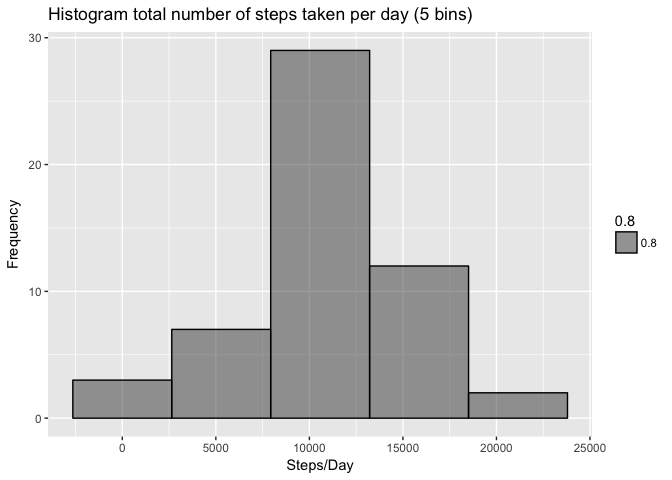
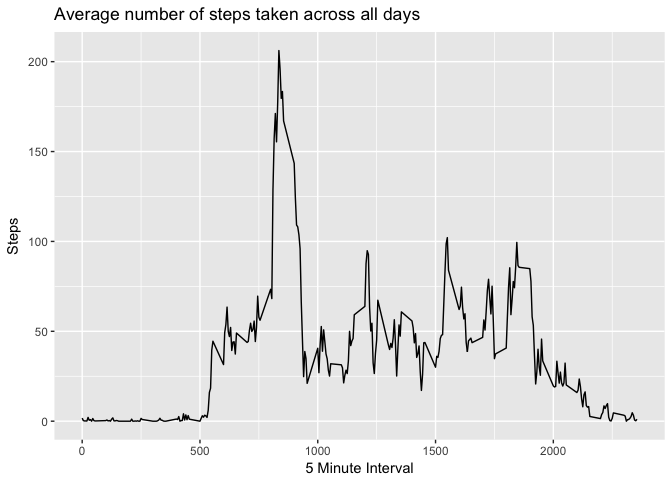
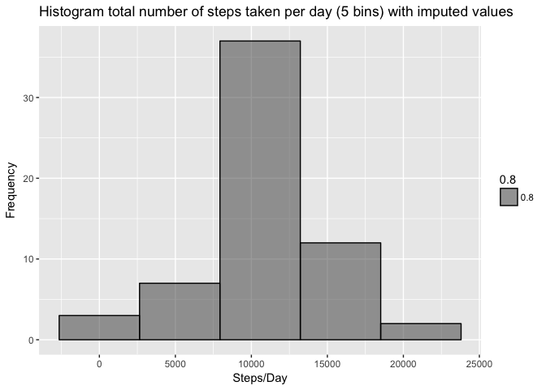
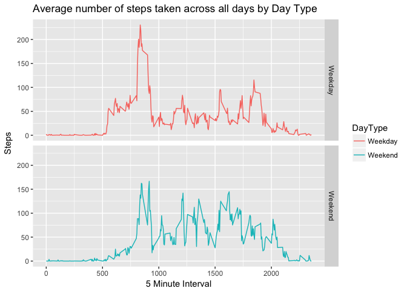

# Peer-graded Assignment: Course Project 1
Gabriel Paredes  

### 1. Code for reading in the dataset and/or processing the data

Loading libraries for the analisys


```r
library(ggplot2)
library(lubridate)
```

```
## 
## Attaching package: 'lubridate'
```

```
## The following object is masked from 'package:base':
## 
##     date
```

```r
library(dplyr)
```

```
## 
## Attaching package: 'dplyr'
```

```
## The following objects are masked from 'package:lubridate':
## 
##     intersect, setdiff, union
```

```
## The following objects are masked from 'package:stats':
## 
##     filter, lag
```

```
## The following objects are masked from 'package:base':
## 
##     intersect, setdiff, setequal, union
```

Reading activity data and transforming colum date to date format

```r
unzip("activity.zip")
activity <- read.csv("activity.csv", stringsAsFactors = FALSE)
activity$date <- ymd(activity$date)
```

### 2. Histogram of the total number of steps taken each day

Constructs the Histogram

```r
totalSteps <- activity %>% group_by(date) %>% summarise(Steps = sum(steps))

qplot(x = Steps, 
      data = totalSteps,
      geom = "histogram",
      bins = 5,
      col = I("black"), 
      alpha = 0.8,
      ylab = "Frequency", 
      xlab = "Steps/Day", 
      main = "Histogram total number of steps taken per day (5 bins)")
```

```
## Warning: Removed 8 rows containing non-finite values (stat_bin).
```



### 3.Calculate and report the mean and median of the total number of steps taken per day


```r
mean(totalSteps$Steps, na.rm = TRUE)
```

```
## [1] 10766.19
```


```r
median(totalSteps$Steps, na.rm = TRUE)
```

```
## [1] 10765
```

### 4. Time series plot of the average number of steps taken


```r
averageIntervalStep <- activity %>% group_by(interval) %>% summarise(Steps = mean(steps, na.rm = TRUE))

qplot(x = interval,
      y = Steps,
      data = averageIntervalStep,
      geom = "line",
      ylab = "Steps",
      xlab = "5 Minute Interval",
      main = "Average number of steps taken across all days"
      )
```



### 5. The 5-minute interval that, on average, contains the maximum number of steps


```r
maxIntervalIndex <- which.max(averageIntervalStep$Steps)
maxInterval <- averageIntervalStep[maxIntervalIndex, ]
print(maxInterval)
```

```
## # A tibble: 1 x 2
##   interval    Steps
##      <int>    <dbl>
## 1      835 206.1698
```

The **835** 5-minute interval, on average across all the days in the dataset, contains **206.1698113** steps

### 6. Code to describe and show a strategy for imputing missing data

Total number of missing values in the dataset

```r
missingIndex <- which(is.na(activity$steps))
length(missingIndex)
```

```
## [1] 2304
```

The missing values in the dataset are goin to be replaced with the mean for that 5-minute interval


```r
fillActivity <- activity

for (i in missingIndex) {
    if (is.na(fillActivity$steps[i])) {
        imputedValue <- averageIntervalStep %>% filter(interval == fillActivity$interval[i]) %>% select(Steps)
        fillActivity$steps[i] <- imputedValue[[1]]
    }
}
```

### 7. Histogram of the total number of steps taken each day after missing values are imputed

Constructs the Histogram with the imputed values

```r
totalStepsFill <- fillActivity %>% group_by(date) %>% summarise(Steps = sum(steps))

qplot(x = Steps, 
      data = totalStepsFill,
      geom = "histogram",
      bins = 5,
      col = I("black"), 
      alpha = 0.8,
      ylab = "Frequency", 
      xlab = "Steps/Day", 
      main = "Histogram total number of steps taken per day (5 bins) with imputed values")
```



Mean Total Steps per Day with imputed values

```r
mean(totalStepsFill$Steps)
```

```
## [1] 10766.19
```

Median Total Steps per Day with imputed values

```r
median(totalStepsFill$Steps)
```

```
## [1] 10766.19
```

The **mean** and **median** for the imputed values differs slightly from the original data set with the excluded NA values

### 7. Panel plot comparing the average number of steps taken per 5-minute interval across weekdays and weekends

Validates if the day is a weekday or a weekend

```r
fillActivityDayType <- mutate(fillActivity, DayType = as.factor(ifelse(wday(date, label = TRUE) == "Sat" | wday(date, label = TRUE) == "Sun","Weekend", "Weekday")))
```

Panel plot containing a time series plot of the 5-minute interval (x-axis) and the average number of steps taken, averaged across all weekday days or weekend days (y-axis)


```r
averageIntervalStepDay <- fillActivityDayType %>% group_by(interval, DayType) %>% summarise(Steps = mean(steps))

qplot(x = interval,
      y = Steps,
      data = averageIntervalStepDay,
      geom = "line",
      ylab = "Steps",
      xlab = "5 Minute Interval",
      main = "Average number of steps taken across all days by Day Type",
      facets =  DayType ~ .,
      color = DayType
      )
```



